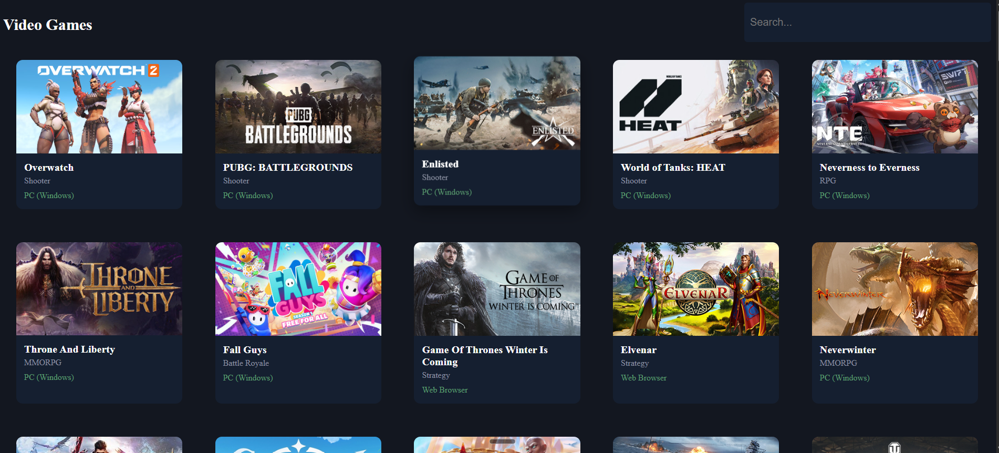

# 🎮 GameHub

A video game discovery app that lets you browse and search hundreds of free-to-play games. Built with vanilla HTML, CSS, and JavaScript.



## Features

- Browse the top 100 free-to-play games on page load
- Search games by title with instant filtering
- Click any card to visit the game's official page
- Responsive grid layout that works on desktop and mobile
- Clean, dark-themed UI

## Built With

- HTML
- CSS (Grid, Flexbox)
- JavaScript (Fetch API, async/await)
- [FreeToGame API](https://www.freetogame.com/api)

## Getting Started

1. Clone the repo
   ```bash
   git clone https://abedoulaye.github.io/video-game-app/
Open index.html in your browser

No API key required — it just works

## How It Works
On load, the app fetches all games from the FreeToGame API

The first 100 are displayed in a responsive grid

Typing in the search bar filters games by title

Each card links to the game's page for more info or download

## API
This project uses the FreeToGame API, a free public API that requires no authentication.

Endpoint used:

GET https://www.freetogame.com/api/games


## License
This project is open source and available under the MIT License.